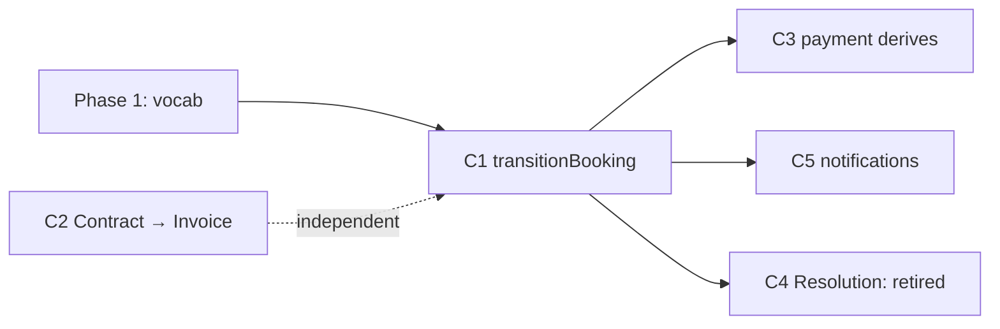

# Architecture Deepening Plan

Living plan for aligning application code with the streamlined Booking model.
Vocabulary: [CONTEXT.md](../CONTEXT.md) (domain) and the architecture glossary below.
Model spec: [booking-state-model.md](booking-state-model.md) · decision: [adr/0003](adr/0003-booking-two-axis-state-model.md).

Iterate across sessions: pick a candidate, do the work, update its **Status** and tick its steps.

**Architecture glossary** (use exactly): *module, interface, implementation, deep/shallow, seam, adapter, leverage, locality.*

## Status at a glance

| # | Deepening | Strength | Depends on | Status |
|---|-----------|----------|-----------|--------|
| 1 | `transitionBooking` — one deep Transition module (incl. guarded Cancelled terminal + distribution seam) | Strong | model vocab (Phase 1) | Not started |
| 2 | Contract → Invoice money model (the money authority) | Strong | — | Not started |
| 3 | Payment state derives; stop duplicating on Booking | Strong | 1 | Not started |
| 4 | ~~Resolution gets its own record~~ — **Retired** (no Resolution axis; cancellation is a guarded terminal transition under C1) | — | — | Retired |
| 5 | Notifications behind the Transition seam | Worth exploring | 1 | Not started |

## Sequencing

---

## C1 — Deepen the Transition (keystone)

**Files:** `packages/shared/src/status-machine.ts`, `apps/web/src/lib/booking/actions.ts:200`,
`apps/web/src/app/api/bookings/[id]/status/route.ts`, `apps/web/src/lib/payments/payment-api.ts`,
`apps/web/src/app/api/stripe/webhook/route.ts`, `apps/web/src/app/api/cron/fund-release/route.ts`,
`apps/web/src/lib/contract/signature-actions.ts`

**Problem:** Lifecycle State is written in five places; three skip validation; none fire a notification;
signing writes `contracts.status` only and never advances the Booking. Lifecycle leaks across call sites.

**Solution (the seam):** one deep module — `transitionBooking(client, bookingId, to)` — owning
validate (status machine) → check Gate → persist → fire notification. Every writer calls it; nobody
writes `bookings.status` directly. Two adapters at the seam: real Supabase client in prod, in-memory in tests.

**Also owns (folded in from retired C4):** the **guarded `Cancelled` terminal transition** (allowed only
from `Signed`/`Advancing`, disallowed at/after `Show Complete`, friction required; side effects: halt pending
charges, audit row, computed statement, notification) and the **distribution seam** that allocates each
collected payment across the invoice line's payees by priority (C2's money model rides this).

**Wins:** locality (all Transition rules in one module) · leverage (one interface, five call sites) ·
Gates + notifications unskippable · the interface is the test surface.

**Steps**
- [ ] Add `transitionBooking` (signature above) co-located with the status machine logic
- [ ] Route `updateBookingStatus` (actions.ts) through it
- [ ] Route the mobile status route through it
- [ ] Route `payment-api`, Stripe `webhook`, `fund-release` cron through it
- [ ] Make signing advance the Booking Lifecycle via it (not just `contracts.status`)
- [ ] Tests cover each edge + each Gate through the one interface
- [ ] `pnpm lint && pnpm test && pnpm build`

**Status:** Not started

---

## C2 — Contract → Invoice money model (the money authority)

> Supersedes the original "Deal Math as the single money authority".
> Full design: [contract-invoice-money-model.md](contract-invoice-money-model.md).

**Files:** `packages/shared/src/deal-math.ts` (retire/rename → contract→invoice derivation),
`apps/web/src/lib/payments/payment-api.ts`, `apps/web/src/lib/payments/payment-math.ts`,
`apps/web/src/lib/invoice/actions.ts`, `apps/web/src/lib/contract/signature-actions.ts`,
`apps/web/src/app/api/stripe/webhook/route.ts`, `apps/web/src/app/api/cron/fund-release/route.ts`,
`supabase/migrations/...`

**Problem:** Money is re-derived with divergent formulas across charge, invoice, transfer, and earnings.
The "single authority" was framed as a display-only `deal-math` helper, while the real source of truth —
the signed contract's terms — is never frozen: terms live mutably on booking tables and nothing
materializes them. There is also no single notion of what the venue owes, who each collected payment is
distributed to, or when.

**Solution (the seam):** The **Booking** owns the live structured terms (financial fee lines + payees and
non-financial policy fields); the **Contract** is the legalese instrument that **renders** them (a projection —
one fact, one home) and **freezes** them into a `terms_snapshot` at the Signed transition. The contract is
thus SoT for the *frozen* terms; live terms are booking-owned. The **Invoice** is a frozen snapshot derived
from `terms_snapshot` and is the single source of truth for money. One pure derivation module (terms →
invoice + schedule + payee distribution) in `@clubstack/shared` replaces "Deal Math"; charge, displayed
numbers, distribution, and cancellation statements all read from it. Distribution is a **generic payee model**:
the booking-scoped fee lines (`booking_fee_lines` / `booking_fee_line_payees`) allocate each collected
payment across their payees `{recipient, entitlement, priority}` in priority order (the waterfall) — no
special-cased roles. Money moves **pay-on-collection** (no escrow): the webhook distributes on
`payment_intent.succeeded`. Collection mode is a **booking term** (`bookings.collection_mode`: manual
invoice — primary — and auto-charge), frozen into the snapshot at Signed.

**Wins:** locality (all money rules in one derivation) · leverage (one snapshot drives shown, invoiced,
charged, distributed) · the Invoice is the test surface · `payment_split_pct` + divergent split fns deleted ·
"Deal Math" retires as a concept.

**Steps** — see [docs/scope.md](scope.md) §2–5 for the full build scope.
- [ ] Structured terms re-keyed to booking (scope.md §2)
- [ ] `terms_snapshot` frozen at Signed; generated clauses render from structured fields (scope.md §3)
- [ ] `deriveInvoice(termsSnapshot)` in `@clubstack/shared`; materialized at Signed (scope.md §4)
- [ ] Generic payee distribution engine; both collection modes (scope.md §5)
- [ ] Parity tests: shown == invoiced == charged == distributed
- [ ] `pnpm db:migrate && pnpm db:types && pnpm lint && pnpm test && pnpm build`

**Status:** Not started

---

## C3 — Payment state derives; stop duplicating on the Booking

**Files:** `packages/shared/src/types.ts` (`BookingStatus`), `payment-api.ts`, `webhook/route.ts`,
`fund-release/route.ts`, earnings SQL, booking migration

**Problem:** `deposit_paid` / `balance_paid` are Payment facts crushed into the Lifecycle enum, duplicating
the `payments` table — two sources of truth.

**Solution:** Lifecycle stops carrying Payment; read Payment from `payments` Installments; the two Gates live
in `transitionBooking`. Rides the phased migration in booking-state-model.md §6.

**ADR:** touches shipped `bookings.status` (ADR-0002) — stage carefully; backfill existing rows.

**Steps**
- [ ] Phase 1 migration: widen Lifecycle vocabulary, backfill
- [ ] `pnpm db:migrate && pnpm db:types`
- [ ] Stop writing `deposit_paid`/`balance_paid` to the Booking
- [ ] Add Deposit-Paid and Balance-Paid Gates
- [ ] Update mobile reads + earnings SQL
- [ ] `pnpm lint && pnpm test && pnpm build`

**Status:** Not started (do after C1)

---

## C4 — Resolution gets its own record — **RETIRED**

> Retired by [contract-invoice-money-model.md](contract-invoice-money-model.md).

The platform is a **payment facilitator, not an escrow agent or arbiter** — disputes settle offline (IRL).
There is therefore **no Resolution axis, no `resolutions` table, and no `Invoked → Under Review → Resolved`
sub-flow** (that sub-flow re-created the mediator role this product refuses). The old "outcome set + per-state
refund rules need legal sign-off" blocker dissolves: refund terms are **negotiated per-deal toggles** in the
contract's `terms_snapshot`, not a global policy.

What replaces it:

- **Cancellation = a guarded terminal Lifecycle transition** (handled under **C1**), recording `cancelled_from`
  + `kind` (cancellation | force_majeure). Allowed only from `Signed`/`Advancing`; disallowed at/after
  `Show Complete`; requires friction (confirm + reason). `Cancelled` is a legitimate terminal Lifecycle state.
- **What money moves is governed by payment progress**, not the source state: nothing collected → statement
  only; **deposit stage** (deposit collected, balance not) → deterministic auto-refund fast-path when the
  snapshot computes a single per-payee amount **and** it is cleanly reversible via `reverse_transfer`, else
  offline; past the deposit stage → offline only.
- **Records:** a thin immutable `cancellations` audit row (with the computed statement) + a first-class
  `refunds` table (parallel to `transfers`); `transfers.reversal_refund_id` links a reversed distribution.
- **Postpone / renegotiate** = a **new contract**, not a sub-state.

**Status:** Retired (folded into C1 + C2)

---

## C5 — Notifications behind the Transition seam

**Files:** `apps/web/src/lib/notifications/send.ts`, all transition sites

**Problem:** `sendNotification` exists but no booking flow calls it — Transitions fire nothing, contradicting
CONTEXT. `send.ts` uses Resend directly while the stack names Knock as the notification layer.

**Solution:** `transitionBooking` becomes the single caller of the notification module; resolve Knock-vs-Resend.

**Wins:** notifications can't be forgotten · one seam, two adapters (Knock prod / fake in tests) ·
every Transition notifies for free.

**Steps**
- [ ] Map each Transition → its NotificationType
- [ ] Call the notification module from `transitionBooking`
- [ ] Resolve Knock vs Resend per AGENTS.md stack
- [ ] Tests assert the right notification per edge
- [ ] `pnpm lint && pnpm test && pnpm build`

**Status:** Not started (folds into C1)
